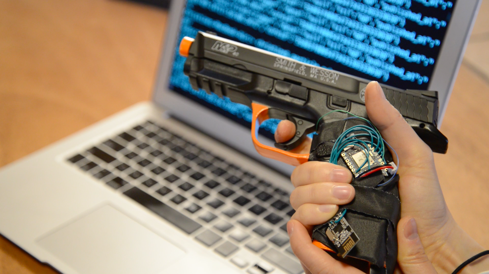

# shots-fired

This internet connected trigger mod will record your time and location every time you discharge your weapon. Device designed and built by [Christine Sunu](http://www.christinesunu.com), idea concepted by [Richard Whitney](http://gra.in), who also took a number of fantastic photographs and videos.

There are two separate devices: one on the trigger to record shots locally, and one on the holster to send data on location to the internet. A set of [nRF24L01 radios](https://github.com/technobly/SparkCore-RF24) pairs the offline [Particle Photon](https://store.particle.io/#photon) microcontroller on the trigger to the [Particle Electron](https://store.particle.io/#electron-3g-americas) cellular microcontroller in the holster.

The Electron runs [cell locate](https://gist.github.com/technobly/cea340d13cb7848196b5) and sends data parsed through [hook.io](http://hook.io), which in turn sends info to a webpage showing time and location on a map. This geolocation webpage was based off of [Hypnopompia's webmap for the Particle Asset Tracker](https://github.com/Hypnopompia/electron-assettracker-webmap).